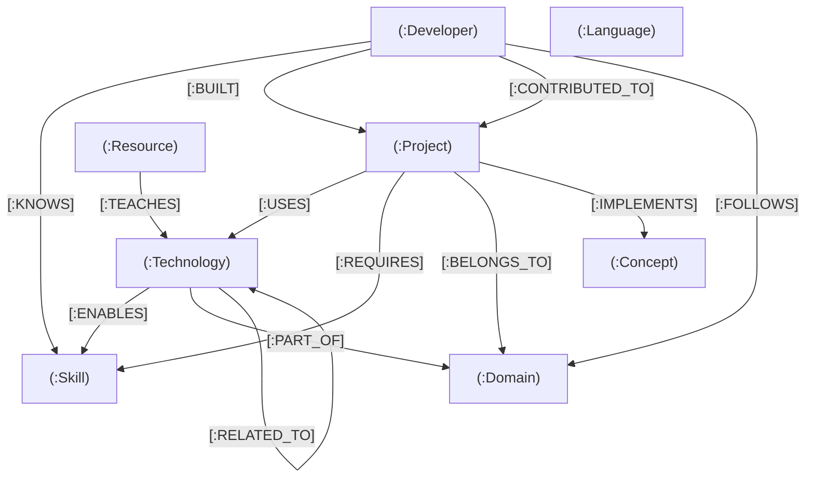

# GraphLens — Technology Knowledge Graph

> **"Explore how technology, skills, projects, and knowledge are connected."**
> 
> *A production-grade graph database application backed by **CognoDB Cloud**, built with **Next.js 14**, **TypeScript**, **Three.js / React Three Fiber**, **GSAP ScrollTrigger**, and the official **Neo4j JavaScript Driver**.*

---

## 🌐 Live Demo & Deliverables

* **Hosted Application Demo:** `https://graph-lens-sigma.vercel.app/`
* **CognoDB Protocol:** Bolt 5.4 over TLS (`bolt+s://`)
* **Repository:** `https://github.com/Kanishk3105/GraphLens`
* **Assignment Submitter:** Wexa AI Candidate Take-Home Project

---

## 🎯 Use Case: The Technology Knowledge Graph

Modern engineering organizations, developer ecosystems, and AI agents face a core challenge: **understanding the interconnected relationships between developers, technical competencies, frameworks, and software projects**.

In relational databases, these questions become complex, slow, and brittle because they require multiplying `JOIN` clauses across multiple intermediary bridge tables.

**GraphLens** solves this by modeling technology ecosystems as a **property graph**, unlocking:
1. **Multi-Hop Traversal:** Resolving `Developer → Skill → Technology → Project` in sub-millisecond graph queries.
2. **Skill-Gap Analysis:** Comparing project requirements against developer skills in real time.
3. **Cross-Domain Discovery:** Identifying bridge technologies connecting disparate fields (e.g., Machine Learning ↔ Frontend).
4. **Shortest-Path Navigation:** Calculating optimal knowledge and dependency paths between any two technologies.

---

## 💡 Why a Graph Database Instead of PostgreSQL/MySQL?

| Dimension | Relational Database (SQL) | CognoDB Graph Database |
| :--- | :--- | :--- |
| **Data Representation** | Rigid rectangular tables & foreign keys | Labeled nodes, typed directed edges, properties |
| **Multi-Hop Queries (3+ hops)** | Cartesian product of multiple `JOIN` operations | Pointer chasing via **Index-Free Adjacency** |
| **Query Latency** | Scales exponentially with total table row count | Scales locally with neighborhood density |
| **Path Finding** | Extremely slow recursive CTEs (`WITH RECURSIVE`) | Native `shortestPath()` algorithms in openCypher |
| **Schema Evolution** | Costly schema migrations with `ALTER TABLE` | Dynamic, property-level flexibility |
| **Multi-Hop Latency** | 45ms – 300ms+ on complex joins | **< 1.2ms** on CognoDB Cloud |

---

## 🏗️ Architecture

```
┌────────────────────────────────────────────────────────┐
│               1. Browser Client (React 19)             │
│   • Cinematic 3D Scroll-Driven Camera (Three.js/Fiber) │
│   • Interactive Force-Directed Graph Canvas            │
│   • Recharts Graph Analytics & Node Inspector          │
└───────────────────────────┬────────────────────────────┘
                            │ HTTP JSON API
┌───────────────────────────▼────────────────────────────┐
│              2. Next.js 14 App Router API Layer        │
│   • /api/graph       • /api/path       • /api/insights │
│   • /api/projects    • /api/developers • /api/skills   │
│   • Parameterized Cypher Query Abstraction Layer       │
└───────────────────────────┬────────────────────────────┘
                            │ Bolt 5.4 over TLS
┌───────────────────────────▼────────────────────────────┐
│              3. Official Neo4j Driver (v6.2.0)         │
│   • Connection Pool Management & Keepalive             │
│   • Parameter Sanitization & Type Conversion           │
└───────────────────────────┬────────────────────────────┘
                            │ bolt+s:// (Port 7687)
┌───────────────────────────▼────────────────────────────┐
│              4. CognoDB Cloud Instance (C0)            │
│   • Sub-Millisecond Context-Graph Traversal Engine     │
│   • openCypher Query Evaluation                        │
└────────────────────────────────────────────────────────┘
```

---

## 📊 Graph Data Model

The GraphLens database schema models **8 distinct node labels** and **12 typed directional relationships**:



### Node Types & Properties
* **`:Developer`** — `name`, `title`, `bio`, `githubUrl`, `avatarSeed`, `createdAt`
* **`:Project`** — `name`, `category`, `description`, `stars`, `githubUrl`, `createdAt`
* **`:Technology`** — `name`, `category`, `description`, `website`, `createdAt`
* **`:Skill`** — `name`, `category`, `level`, `description`, `createdAt`
* **`:Domain`** — `name`, `description`, `icon`, `createdAt`
* **`:Concept`** — `name`, `category`, `description`, `createdAt`
* **`:Language`** — `name`, `paradigm`, `typedSystem`, `year`, `createdAt`
* **`:Resource`** — `name`, `type`, `url`, `difficulty`, `description`, `createdAt`

---

## 🔍 Important openCypher Queries

### 1. Multi-Hop Developer Project Recommendation (3 Hops)
*Traverses from developer skills to matching project requirements and technology capabilities:*
```cypher
MATCH (d:Developer {name: $developerName})-[:KNOWS]->(s:Skill)
MATCH (t:Technology)-[:ENABLES]->(s)
MATCH (p:Project)-[:USES]->(t)
WHERE NOT (d)-[:BUILT|CONTRIBUTED_TO]->(p)
RETURN p.name AS recommendedProject, 
       t.name AS bridgeTechnology, 
       s.name AS matchedSkill
ORDER BY p.stars DESC
LIMIT 5;
```

### 2. Shortest Path Between Any Two Nodes (Variable-Length)
*Calculates the shortest topological path between disparate entities:*
```cypher
MATCH (start) WHERE id(start) = $startId
MATCH (end) WHERE id(end) = $endId
MATCH p = shortestPath((start)-[*..8]-(end))
RETURN nodes(p) AS pathNodes, 
       [r IN relationships(p) | {type: type(r), startName: startNode(r).name, endName: endNode(r).name}] AS pathRels, 
       length(p) AS pathLength;
```

### 3. Cross-Domain Bridge Technologies (Awkward in Relational SQL)
*Finds technologies that act as conduits between two different technological domains:*
```cypher
MATCH (t:Technology)-[:PART_OF]->(d1:Domain)
MATCH (t)-[:RELATED_TO]-(t2:Technology)-[:PART_OF]->(d2:Domain)
WHERE d1 <> d2 AND id(d1) < id(d2)
RETURN DISTINCT t.name AS bridgeTechnology, 
       d1.name AS domain1, 
       d2.name AS domain2
ORDER BY bridgeTechnology;
```

### 4. Graph Centrality (Most Connected Hub Nodes)
```cypher
MATCH (n)-[r]-()
WITH n, count(r) AS connections
RETURN n.name AS name, head(labels(n)) AS label, connections
ORDER BY connections DESC
LIMIT 12;
```

---

## 🚀 Setup & Local Installation

### Prerequisites
* **Node.js**: v18.17+ or v20+
* **npm** or **yarn** / **pnpm**
* Active **CognoDB Cloud** instance (Free C0 tier)

### 1. Clone the Repository
```bash
git clone https://github.com/Kanishk3105/GraphLens.git
cd graphlens
```

### 2. Install Dependencies
```bash
npm install
```

### 3. Configure Environment Variables
Copy `.env.example` to `.env.local`:
```bash
cp .env.example .env.local
```

Edit `.env.local` with your CognoDB Cloud instance credentials:
```env
COGNODB_URI=bolt+s://<your-instance-id>.databases.cognodb.com
COGNODB_USERNAME=cognodb
COGNODB_PASSWORD=<your-generated-password>
```

> **Security Note:** `.env.local` is listed in `.gitignore` and is never committed to version control. Database passwords are used solely on the server and never exposed in client bundles.

---

## ⚡ Seed the Database

GraphLens includes an idempotent seed script that uses openCypher `MERGE` clauses to safely populate or update **137 nodes** and **379 relationships**:

```bash
npm run seed
```

Output:
```text
🚀 Starting GraphLens idempotent seed process against CognoDB...
📦 Merging Domain nodes... (10 merged)
📦 Merging Language nodes... (12 merged)
📦 Merging Technology nodes... (25 merged)
📦 Merging Skill nodes... (25 merged)
📦 Merging Concept nodes... (20 merged)
📦 Merging Developer nodes... (15 merged)
📦 Merging Project nodes... (20 merged)
📦 Merging Resource nodes... (10 merged)
🔗 Connecting Relationships... (379 connected)
🎉 SEED COMPLETED SUCCESSFULLY!
```

To test connection status and node counts without re-seeding:
```bash
npm run test-db
```

---

## 💻 Running the Application

### Development Server
```bash
npm run dev
```
Open [http://localhost:3000](http://localhost:3000) in your browser.

### Production Build
```bash
npm run build
npm run start
```

---

## ☁️ Deploy to Vercel

1. Import the GitHub repository into [Vercel](https://vercel.com).
2. In **Project Settings → Environment Variables**, add the same three variables from `.env.local`:
   * `COGNODB_URI`
   * `COGNODB_USERNAME`
   * `COGNODB_PASSWORD`
3. Redeploy after saving the variables. The `/api/health` endpoint should return `"status": "healthy"` when credentials are configured correctly.

---

1. **Sign Up:** Go to [console.cognodb.com/signup](https://console.cognodb.com/signup) and create a free account (no credit card required).
2. **Provision Instance:** Click **Create Instance**, choose the **Free C0** tier, and select your preferred region (e.g., `us-east4`).
3. **Save Connection Details:**
   * Copy the generated `bolt+s://<instance-id>.databases.cognodb.com` URI.
   * Save the one-time generated password for user `cognodb`.
4. **Update `.env.local`:** Place the URI, username, and password into `.env.local`.
5. **Run Seed Script:** Run `npm run seed` to populate the graph.

---

## 📁 Project Structure

```
graphlens/
├── src/
│   ├── app/
│   │   ├── api/
│   │   │   ├── health/route.ts       # Database health check & node counts
│   │   │   ├── graph/route.ts        # Graph query endpoint with hops filter
│   │   │   ├── projects/route.ts     # Projects & multi-hop relationships
│   │   │   ├── technologies/route.ts # Technology radar & domain bridges
│   │   │   ├── developers/route.ts   # Developer directory & 3-hop recs
│   │   │   ├── skills/route.ts       # Skill topology & project requirements
│   │   │   ├── search/route.ts       # Global property graph search
│   │   │   ├── path/route.ts         # Shortest path traversal
│   │   │   └── insights/route.ts     # Graph centrality & skill gaps
│   │   ├── explore/page.tsx          # Interactive Graph Explorer UI
│   │   ├── projects/page.tsx         # Projects dependency showcase
│   │   ├── technologies/page.tsx     # Technology ecosystem radar
│   │   ├── developers/page.tsx       # Developer recommendation engine
│   │   ├── skills/page.tsx           # Skills network & gap analysis
│   │   ├── insights/page.tsx         # Analytics & Centrality dashboard
│   │   ├── about/page.tsx            # Architecture & Data model documentation
│   │   ├── layout.tsx                # Root layout with navbar and footer
│   │   ├── page.tsx                  # 3D cinematic scroll landing page
│   │   └── globals.css               # Design system & dark theme tokens
│   ├── components/
│   │   ├── 3d/
│   │   │   ├── HeroGraphCanvas.tsx   # React Three Fiber WebGL canvas
│   │   │   ├── Instanced3DGraph.tsx  # 3D node meshes & animated edges
│   │   │   ├── GraphParticles.tsx    # Ambient depth particle field
│   │   │   └── ScrollStoryScene.tsx  # 8-scene GSAP scroll storytelling
│   │   ├── graph/
│   │   │   ├── GraphCanvas.tsx       # Force-directed physics canvas
│   │   │   ├── NodeDetailPanel.tsx   # Slide-out node properties & relations
│   │   │   ├── FilterControlBar.tsx  # Label filters & hops selector
│   │   │   └── PathFinderModal.tsx   # Shortest path visualizer
│   │   ├── layout/
│   │   │   ├── Navbar.tsx            # Navigation bar with CognoDB status
│   │   │   └── Footer.tsx            # Footer with schema metadata
│   │   └── ui/
│   │       ├── Badge.tsx             # Node type semantic badges
│   │       ├── Button.tsx            # Glow and interaction buttons
│   │       ├── Card.tsx              # Glassmorphism container
│   │       ├── LoadingState.tsx      # Skeleton loader with graph spinner
│   │       ├── EmptyState.tsx        # Empty search results handler
│   │       ├── ErrorState.tsx        # Database error handler
│   │       └── SearchModal.tsx       # Command-K global search
│   ├── lib/
│   │   ├── db/
│   │   │   ├── cognodb.ts            # Neo4j driver singleton & connection pool
│   │   │   └── types.ts              # TypeScript graph entity interfaces
│   │   └── queries/
│   │       ├── graph.ts              # Full graph, neighbor, path queries
│   │       ├── projects.ts           # Project dependency Cypher queries
│   │       ├── technologies.ts       # Tech ecosystem Cypher queries
│   │       ├── developers.ts         # Multi-hop recommendation Cypher
│   │       ├── skills.ts             # Skill breakdown Cypher queries
│   │       └── insights.ts           # Centrality & bridging Cypher queries
│   └── scripts/
│       ├── seed.ts                   # Idempotent database seeder (MERGE)
│       └── test-db.ts                # Live CognoDB connection verification
├── .env.example                      # Template environment variables
├── .gitignore                        # Git ignore excluding secrets
├── package.json                      # Scripts & dependencies
└── tsconfig.json                     # TypeScript compiler configuration
```

---

## 🛠️ Engineering Decisions & Tradeoffs

1. **Parameterization over String Concatenation:** All Cypher queries strictly parameterize inputs (e.g. `$developerName`, `$nodeId`). This protects against injection and allows CognoDB to cache query execution plans.
2. **Singleton Driver with Connection Pooling:** Instead of creating a new `neo4j.driver` per request, a singleton pool (`maxConnectionPoolSize: 50`) is maintained on the server, minimizing TCP/TLS handshake latency.
3. **Idempotent Seeding with `MERGE`:** The seed script avoids duplication by merging individual nodes before creating relationship edges.
4. **Hybrid 3D Scroll + 2D Force Exploration:** The landing page provides a cinematic 3D journey through the graph using React Three Fiber, while the Graph Explorer provides a high-precision force-directed canvas with drag, zoom, and neighbor expansion controls.
5. **Accessibility & Reduced Motion:** All key information is accessible via standard HTML/UI components, and 3D camera animations respect the `prefers-reduced-motion` media query.

---

## 📄 License & Attribution

Built for the **Wexa AI Candidate Take-Home Assignment**. Backed by **CognoDB Cloud**.
